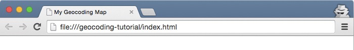
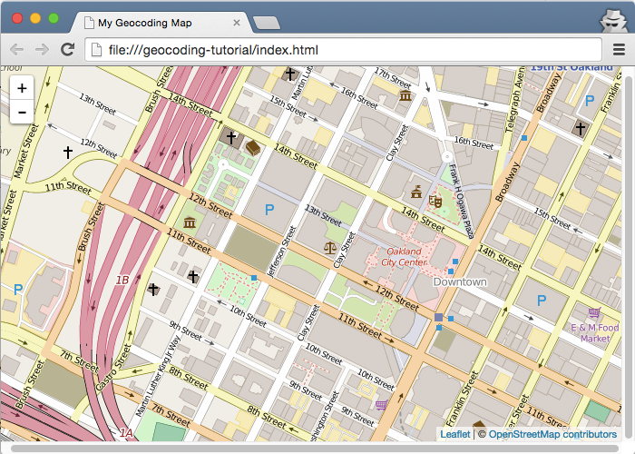
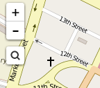
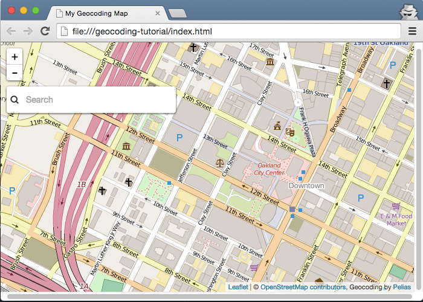
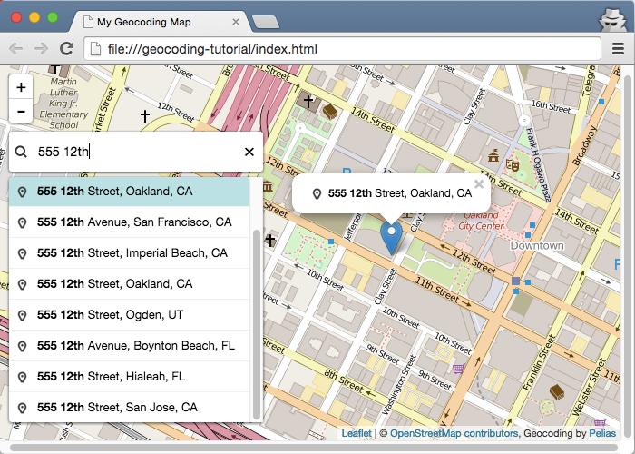

# Add the Mapzen Search geocoder to a map

[Mapzen Search](https://mapzen.com/projects/search) is a modern, geographic search service based entirely on open-source tools and open data. Use this functionality to enhance any app that has a geographic context, such as ones that assist in delivering goods, locating hotels or venues, or providing local weather forecasts.

Through a process known as [geocoding](https://en.wikipedia.org/wiki/Geocoding), Mapzen Search allows you to enter an address or the name of a landmark or business, and the service translates the result into geographic coordinates for mapping. Mapzen Search is built on [Pelias](https://github.com/pelias), an open-source geocoding project.

In this walkthrough, you will learn how to make a map with a search box that allows you to enter addresses and place names and locate them on a map. To complete the tutorial, you should have some familiarity with HTML and JavaScript, although all the source code is provided.

## Download and install the dependencies

The Leaflet JavaScript library, which provides tools for zooming, displaying attributions, and drawing symbols, is a framework you can use to build web and mobile maps. Leaflet is extensible, and developers have built additional tools for Leaflet maps, including the Mapzen Search geocoder plug-in.

To set up your development environment for this walkthrough, you need to download the geocoder plug-in. You do not need to download the Leaflet files because you will be referencing them from a web server.

1. Download the zip file from https://github.com/pelias/pelias-doc/raw/master/geocoding-tutorial.zip.

2. Find the file in your default downloads directory and unzip it. It should unzip to a folder named `geocoding-tutorial`. (Note that some browsers, such as Safari, may unzip automatically.)
3. Make sure your `geocoding-tutorial` folder has `pelias-leaflet-geocoder.css`, `pelias-leaflet-geocoder.js`, an images folder, and two HTML files.

    

## Create an index page

With the files downloaded, you are ready to start building your map. You will need to use a text editor to update the HTML.

Suggested text editor applications include [Atom - OS X, Windows, Linux](https://atom.io/); [Notepad++ - Windows](https://notepad-plus-plus.org/); [TextWrangler - OS X](http://www.barebones.com/products/textwrangler/); and  [Sublime - OS X, Windows, Linux; free trial](http://www.sublimetext.com/). While you can use the apps installed with your operating system, such as Notepad or TextEdit, they do not provide the helpful indentations, code coloring and autocomplete, or text alignment options found in the other editors. For TextEdit, you must go to the Format menu and click Make Plain Text to use the plain-text version of the file. Do not use an app that applies rich formatting, such as Word or Wordpad.

The geocoding-tutorial folder contains two HTML files: `index.html` is the file you will start with and update in the steps, while `index-complete.html` is a finished version to check your work or review if you need to troubleshoot an error.

1. From your `geocoding-tutorial` folder, open `index.html` in a text editor. It should look like this:

    ```html
    <!DOCTYPE html>
    <html>
    <head>
    </head>
    <body>
    </body>
    </html>
    ```

    These form the basic structure of an HTML document. `<!DOCTYPE html>` goes at the top of every HTML page and indicates that it is written for HTML5, and the `<html>` tags tell your browser that the content is HTML. The `<head>` tag contains the title for the page and other metadata about the page, while the `<body>` is where you add the code and the rest of the content on your page. There are many [web tutorials](http://www.w3schools.com/html/default.asp) available to help you experiment with and learn more about HTML documents and the tags in them.

2. In the `<head>` tag, add a title, such as `<title>My Geocoding Map</title>`.
3. On the next line, add a metadata tag so you can properly display diacritics and characters from different languages.

  ```html
  <meta charset="utf-8">
  ```

4. Save your edits to the index.html file.
5. Drag your index.html file onto a web browser tab. It should show your title, `My Geocoding Map`, but the web page canvas will be blank.

  

You HTML should look like this:
```html
<!DOCTYPE html>
<html>
<head>
  <title>My Geocoding Map</title>
  <meta charset="utf-8">
</head>
<body>
</body>
</html>
```

## Add references to CSS and JavaScript files

A cascading style sheet (CSS) is used to style a webpage, including layout and fonts, and JavaScript adds functionality to the page. In your index.html file, you need to list the CSS and JavaScript files required for building a page with Leaflet and the geocoder plug-in.

1. In `index.html`, at the bottom of the `<head>` section, add references to the Leaflet CSS and JavaScript files. You are linking to these from a remote website, rather than from a file on your machine.

    ```html
    <link rel="stylesheet" href="https://cdnjs.cloudflare.com/ajax/libs/leaflet/0.7.5/leaflet.css">
    <script src="https://cdnjs.cloudflare.com/ajax/libs/leaflet/0.7.5/leaflet.js"></script>
    ```

2. In the `<head>` section, immediately after the lines you added for Leaflet, add references to the geocoder's CSS and JavaScript files. These files are from the zipped file you copied to your machine.

    ```html
    <link rel="stylesheet" href="pelias-leaflet-geocoder.css">
    <script src="pelias-leaflet-geocoder.js"></script>
    ```

3. Save your edits and refresh the browser. The webpage should still appear empty because you have not added any code to interact with these references.

After adding these, your index.html file should look something like this.

```html
<!DOCTYPE html>
<html>
  <head>
  <title>My Geocoding Map</title>
  <meta charset="utf-8">
  <link rel="stylesheet" href="https://cdnjs.cloudflare.com/ajax/libs/leaflet/0.7.5/leaflet.css">
  <script src="https://cdnjs.cloudflare.com/ajax/libs/leaflet/0.7.5/leaflet.js"></script>
  <link rel="stylesheet" href="pelias-leaflet-geocoder.css">
  <script src="pelias-leaflet-geocoder.js"></script>
</head>
<body>
</body>
</html>
```

## Add a map to the page

To display a Leaflet map on a page, you need a `<div>` element, which is a container on the page that groups elements, with an ID value. If you want to know more about initializing a Leaflet map, see the [Leaflet getting started documentation](http://leafletjs.com/examples/quick-start.html).

1. At the bottom of the `<head>` section, after the references you added in the previous steps, add a `<style>` tag and the following attributes to set the size of the map on your webpage.

  ```html
  <style>
    #map {
      height: 100%;
      width: 100%;
      position: absolute;
    }
    html,body{margin: 0; padding: 0}
  </style>
  ```

2. At the top of the `<body>` section, add the `<div>`.

    ```html
    <div id="map"></div>
    ```

3. Immediately after the `<div>`, add this JavaScript code within a `<script>` tag to initialize Leaflet.

    ```html
    <script>
      var map = L.map('map').setView([37.804146, -122.275045], 16);
    </script>
    ```

    `L.xxxxx` is a convention used with the Leaflet API. The `setView([37.804146, -122.275045], 16)` part sets the center of the map, in decimal degrees, and the zoom level. The map is centered at the MaptimeOAK meeting location, with a zoom level that allows you to see the streets and features of the city. Zoom levels are similar to map scales or resolutions, where a smaller value shows a larger area in less detail, and a larger zoom level value depicts smaller area in great detail.

4. Within the same `<script>` tag, start a new line and set the data source for the map. This line adds the default OpenStreetMap tiles and an attribution.

    ```html
    L.tileLayer('http://{s}.tile.osm.org/{z}/{x}/{y}.png', {
      attribution: '&copy; <a href="http://openstreetmap.org/copyright">OpenStreetMap contributors</a>'
    }).addTo(map);
    ```
5. Save your edits and refresh the browser.

Your index.html should look something like this:

```html
<!DOCTYPE html>
<html>
<head>
  <title>My Geocoding Map</title>
  <meta charset="utf-8">
  <link rel="stylesheet" href="https://cdnjs.cloudflare.com/ajax/libs/leaflet/0.7.5/leaflet.css">
  <script src="https://cdnjs.cloudflare.com/ajax/libs/leaflet/0.7.5/leaflet.js"></script>
  <link rel="stylesheet" href="pelias-leaflet-geocoder.css">
  <script src="pelias-leaflet-geocoder.js"></script>
  <style>
    #map {
      height: 100%;
      width: 100%;
      position: absolute;
    }
    html,body{margin: 0; padding: 0}
  </style>
</head>
<body>
  <div id="map"></div>
  <script>
    var map = L.map('map').setView([37.804146, -122.275045], 16);
    L.tileLayer('http://{s}.tile.osm.org/{z}/{x}/{y}.png', {
      attribution: '&copy; <a href="http://openstreetmap.org/copyright">OpenStreetMap contributors</a>'
    }).addTo(map);
  </script>
</body>
</html>
```

At this point, you have a map! You should see a map with OpenStreetMap tiles, zoom controls, and a Leaflet attribution in the bottom corner.



## Add the Search box

So far, you have referenced the necessary files, initialized Leaflet with a map container on the page, and added data to the map. Now, you are ready to add the Search box from the Mapzen Search plug-in.

1. Inside the same `<script>` tag, start a new line after the `}).addTo(map);` line, and initialize a search box with the following code.

    ```js
    var geocoder = L.control.geocoder('search-VzKH_PI').addTo(map);
    ```

    The `search-VzKH_PI` text is the Mapzen Search [API key](https://en.wikipedia.org/wiki/Application_programming_interface_key). Because the search service is shared among many users, an API key is a way to make sure that the performance is acceptable for everyone. The key you are provided at MaptimeOAK will expire, so if you want to use Mapzen Search after this event, you need to obtain your own API key from https://mapzen.com/developers and replace it here.

2. Save your edits and refresh the browser. You should see a small magnifying glass icon in the left corner, near the zoom controls.

    

3. Click the button to display the Search box on the map. The Search box closes if you click away from it.

    

Your `<body>` section should look like this:

```html
[...]
<body>
  <div id="map"></div>
  <script>
    var map = L.map('map').setView([37.804146, -122.275045], 16);
    L.tileLayer('http://{s}.tile.osm.org/{z}/{x}/{y}.png', {
      attribution: '&copy; <a href="http://openstreetmap.org/copyright">OpenStreetMap contributors</a>'
    }).addTo(map);
    var geocoder = L.control.geocoder('search-VzKH_PI').addTo(map);
  </script>
</body>
[...]]
```

## Search for places on the map

1. On the map, type `555 12th` in the Search box. As you type, the text automatically completes to suggest matching results.
2. In the results list, find the entry for `555 12th Street, Oakland, CA` and click it to zoom and add a point to the map at that location. (The point is only on your map, and does not update OpenStreetMap.)

    

If you want to [customize the geocoder plug-in behavior](https://github.com/pelias/leaflet-geocoder#customizing-the-plugin) beyond the defaults in this Walkthrough, you can set additional options in your code. For example, the Search box collapses to an icon by default, but you can specify that the text box be shown at full width. There are also options for customizing the parameters for the Mapzen Search service, such as limiting the search to the map's extent or prioritizing results near the current view. Right now, you may notice that results from around the world appear in the list.

Mapzen Search uses a [variety of open data sources](https://mapzen.com/documentation/search/data-sources/), including OpenStreetMap. Part of the power of open data is that anyone can modify the source data and improve the quality for everyone. If you are unable to find a location, the place could be missing or incorrect in the source datasets. Mapzen is also building a comprehensive, open database of places known as [Who's on First](https://github.com/whosonfirst/whosonfirst-data) that can be publicly edited, and is working on integrating it into the geocoder.  

Because the geocoder is still under development and considered experimental, if you are getting unexpected search results, please add an issue to the [Pelias GitHub repository](https://github.com/pelias/pelias/issues). The developers can investigate and determine if the problem is caused by software or data, and work to fix it either way.

To take your map even further, you can follow along with some additional Mapzen tutorials. One exercise you can try is to use [Mapzen's Tangram rendering engine](https://mapzen.com/documentation/turn-by-turn/add-routing-to-a-map/#add-a-tangram-map-to-the-frame) and vector tiles to draw the data on the map, instead of the OpenStreetMap raster tile layer you used in this walkthrough. When you get your map the way you want, you might be interested [putting your map on the web](https://mapzen.com/documentation/tangram/walkthrough/#put-your-tangram-map-on-the-web) so you can share your work with others.

## Walkthrough summary

In this walkthrough, you learned the basics of adding the Mapzen Search geocoding engine to a Leaflet map. If you want to learn more about Mapzen Search, review the [documentation](https://mapzen.com/documentation/search/).
