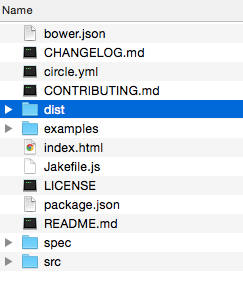
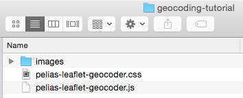
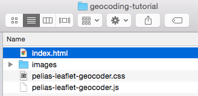

# Add Mapzen Search geocoder to a map

[Add some intro text about geocoding]

To complete the tutorial, you should have some familiarity with HTML and JavaScript, although all the source code is provided. You will need an [API key](https://mapzen.com/developers) to use Mapzen Search, which requires a GitHub account for authorization. You can use any text editor and operating system, but must maintain an Internet connection while you are working. The tutorial should take about an hour to complete.

## Sign up for a Mapzen Search API key

***For Maptime Oakland: Note that this section is optional during the Maptime Oakland event. You will be provided with a sample key that will expire following the event. If you want to continue using the Mapzen Search service, you need to get your own API key.***

To use the geocoding service, you must first obtain an API key from Mapzen. Sign in at https://mapzen.com/developers to create and manage your API keys.

Mapzen Search, powered by Pelias, is a shared geocoding service. As such, there are limitations on requests to prevent individual users from degrading the overall system performance.

1. Go to https://mapzen.com/developers.
2. Sign in with your GitHub account. If you have not done this before, you need to agree to the terms first.
3. Create a new key for Mapzen Search, and optionally, give it a project name so you can remember the purpose of the key.
4. Keep the web page open so you can copy the key into the source code later.

## Download and install the dependencies

The Leaflet JavaScript library, which provides tools for zooming, displaying attributions, and drawing symbols, is one way you can display the Mapzen Search input box on web and mobile maps. Leaflet is extensible, and developers have built additional tools for Leaflet maps, including the Mapzen Search plug-in.

To set up your development environment for this walkthrough, you need to download the geocoder plug-in.

1. Create a new folder on your machine named `geocoding-tutorial`. You will use this folder as your working directory where you can store the downloaded files.
3. Download or clone the [leaflet-geocoder GitHub repository](https://github.com/pelias/leaflet-geocoder) to make a copy of it on your local machine. You can click [Download Zip](https://github.com/pelias/leaflet-geocoder/archive/master.zip) on the GitHub repository website.
4. Unzip any zipped files you downloaded.
5. Navigate to `leaflet-geocoder` folder (`leaflet-geocoder-master`, if you downloaded the zip).

    

6. Navigate inside the `dist` subfolder and copy the images folder, leaflet-geocoder.css, and leaflet-geocoder.js files.
7. Paste the images folder and two files into your `geocoding-tutorial` folder.
    

## Create an index page

Now that you have downloaded the required dependent files, you are ready to start building your application. This example uses the simplest structure, a single index.html file.

1. At the root level of your working folder, create a file called index.html and open it in a text editor.

    

2. Add the basic HTML tags, including `<!DOCTYPE HTML>`, `<html>`, `<head>`, and `<body>`. Your HTML might look like this:

    ```html
    <!DOCTYPE html>
    <html>
    <head>
    </head>
    <body>
    </body>
    </html>
    ```

3. In the `<head>` tag, add a title, such as `<title>My Geocoding Map</title>`.
4. On the next line, add a metadata tag to set the character encoding.
  ```html
  <meta charset="utf-8">
  ```
4. Save your edits to the index.html file.
5. Drag your index.html file onto a web browser tab. It should show your title, `My Geocoding Map`, but the web page canvas is blank.

  

You HTML should look like this:
```html
<!DOCTYPE html>
<html>
<head>
  <title>My Geocoding Map</title>
  <meta charset="utf-8">
</head>
<body>
</body>
</html>
```

As you are working, it’s a good idea to save your edits and periodically reload the browser page. This helps you identify problems quicker and trace them back to your most recent changes.

## Add references to CSS and JavaScript files

Because you are working with several external cascading style sheet (CSS) and JavaScript files, you need to add references to them in your index.html file. These include style sheets and JavaScript files for Leaflet and the Geocoder. You will need to add these into the <head> and <body> sections of the index.html.

1. In index.html, at the bottom of the `<head>` section, add references to the Leaflet CSS and JavaScript files. You are referencing these from the website, rather than from a file on your machine.

    ```html
    <link rel="stylesheet" href="https://cdnjs.cloudflare.com/ajax/libs/leaflet/0.7.5/leaflet.css">
    <script src="https://cdnjs.cloudflare.com/ajax/libs/leaflet/0.7.5/leaflet.js"></script>
    ```

2. In the `<head>` section, immediately after the Leaflet lines, add references to the geocoder CSS and JavaScript files. These files are from the GitHub repository you copied and are on your own machine.

    ```html
    <link rel="stylesheet" href="../geocoding-tutorial/pelias-leaflet-geocoder.css">
    <script src="../geocoding-tutorial/pelias-leaflet-geocoder.js"></script>
    ```

7. Save your edits and refresh the browser. It should appear as before because you have not added any code to interact with these references.

After adding these, your index.html file should look something like this.

```html
<!DOCTYPE html>
<html>
  <head>
  <title>My Geocoding Map</title>
  <meta charset="utf-8">
  <link rel="stylesheet" href="https://cdnjs.cloudflare.com/ajax/libs/leaflet/0.7.5/leaflet.css">
  <script src="https://cdnjs.cloudflare.com/ajax/libs/leaflet/0.7.5/leaflet.js"></script>
  <link rel="stylesheet" href="../geocoding-tutorial/pelias-leaflet-geocoder.css">
  <script src="../geocoding-tutorial/pelias-leaflet-geocoder.js"></script>
</head>
<body>
</body>
</html>
```

## Add a map to the page

To display a Leaflet map on a page, you need a `<div>` element with an ID value, as well as a size for the box containing the map. If you want to know more about initializing a Leaflet map, see the [Leaflet getting started documentation](http://leafletjs.com/examples/quick-start.html).

1. At the bottom of the `<head>` section, following the references you added in the previous steps, add a `<style>` tag and the following size attributes to set the size of the map.

  ```html
  <style>
    #map {
      height: 100%;
      width: 100%;
      position: absolute;
    }
  </style>
  ```

2. At the top of the `<body>` section, add the `<div>`.

    ```html
    <div id="map"></div>
    ```

3. Immediately after the `<div>`, add the following JavaScript within a `<script>` tag to initialize Leaflet. `L.xxxxx` is a convention used with the Leaflet API. The `setView([37.804146, -122.275045], 16)` sets the center of the map, in decimal degrees, and the zoom level. The map is centered at the Maptime Oakland meeting location, with a zoom level that allows you to see the streets and features of the city. Zoom levels are similar to map scales or resolutions, where a smaller value shows a larger area in less detail, and a larger zoom level value depicts smaller area in great detail.

    ```html
    <script>
      var map = L.map('map').setView([37.804146, -122.275045], 16);
    </script>
    ```
4. Within the same script tag as `var map = `, add a line to set the data source for the map. This line adds the default OpenStreetMap tiles and an attribution.

    ```html
    L.tileLayer('http://{s}.tile.osm.org/{z}/{x}/{y}.png', {
      attribution: '&copy; <a href="http://openstreetmap.org/copyright">OpenStreetMap contributors</a>'
    }).addTo(map);
    ```
5. Save your edits and refresh the browser. You should see a map with OpenStreetMap tiles, zoom controls, and a Leaflet attribution in the bottom corner.

    

Your index.html should look something like this:

```html
<!DOCTYPE html>
<html>
<head>
  <title>My Geocoding Map</title>
  <meta charset="utf-8">
  <link rel="stylesheet" href="https://cdnjs.cloudflare.com/ajax/libs/leaflet/0.7.5/leaflet.css">
  <script src="https://cdnjs.cloudflare.com/ajax/libs/leaflet/0.7.5/leaflet.js"></script>
  <link rel="stylesheet" href="../geocoding-tutorial/pelias-leaflet-geocoder.css">
  <script src="../geocoding-tutorial/pelias-leaflet-geocoder.js"></script>
  <style>
    #map {
      height: 100%;
      width: 100%;
      position: absolute;
    }
  </style>
</head>
<body>
  <div id="map"></div>
  <script>
    var map = L.map('map').setView([37.804146, -122.275045], 16);
    L.tileLayer('http://{s}.tile.osm.org/{z}/{x}/{y}.png', {
      attribution: '&copy; <a href="http://openstreetmap.org/copyright">OpenStreetMap contributors</a>'
    }).addTo(map);
  </script>
</body>
</html>
```

## Add the geocoder search box

So far, you have referenced the necessary files, initialized Leaflet with a map container on the page, and added data to the map. Now, you are ready to add the search box with the Mapzen Search plug-in.

1. Inside the `<script>` tag, and after the `}).addTo(map);` line, initialize a search box with the following code. You must include a valid Mapzen Search API key to make the map load properly. If you have obtained your own API key from https://mapzen.com/developers, you can paste it here. The key in this tutorial will expire following this event.

    ```js
    var geocoder = L.control.geocoder('search-MKZrG6M').addTo(map);
    ```
2. Save your edits and refresh the browser. You should see a small magnifying glass icon in the left corner, near the zoom controls.

    

3. Click the button to display the Search box on the map. The Search box closes if you click away from it.

    

Your `<body>` section should look like this:

```html
[...]
<body>
  <div id="map"></div>
  <script>
    var map = L.map('map').setView([37.804146, -122.275045], 16);
    L.tileLayer('http://{s}.tile.osm.org/{z}/{x}/{y}.png', {
      attribution: '&copy; <a href="http://openstreetmap.org/copyright">OpenStreetMap contributors</a>'
    }).addTo(map);
    var geocoder = L.control.geocoder('search-MKZrG6M').addTo(map);
  </script>
</body>
[...]]
```

## Search for places on the map

1. On the map, type a place name or address in the Search box. As you type, the text is being automatically completed to find matching results.
2. Click a result in the list to zoom and add a point to the map at that location.

    

## Walkthrough summary and next steps

[Add summary]

In this walkthrough, you learned the basics of making a map with the Mapzen Search geocoding engine in a Leaflet map.

You can review the [documentation](https://github.com/valhalla/valhalla-docs/blob/master/api-reference.md) to learn more about routing with Mapzen Turn-by-Turn.
