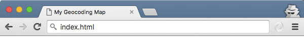
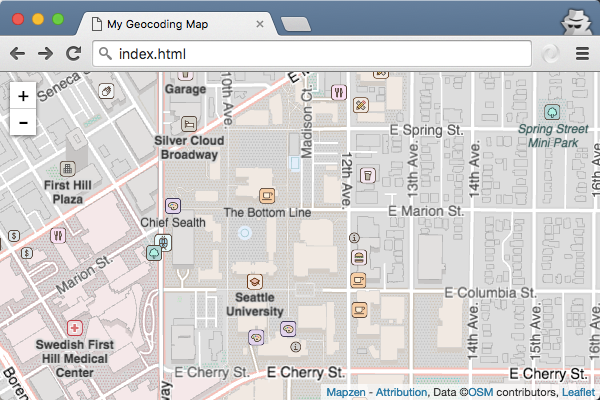
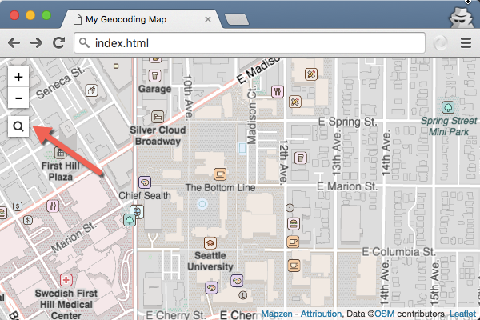
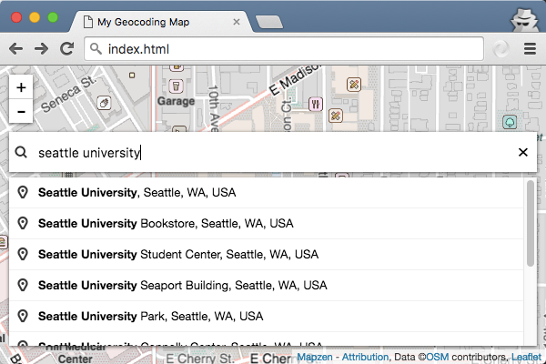
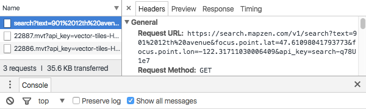

# Add the Pelias geocoder to a map

[Pelias](https://mapzen.com/products/search/) is a modern, geographic search service based entirely on open-source tools and open data. Use this functionality to enhance any app that has a geographic context, such as ones that help in delivering goods, locating hotels or venues, or providing local weather forecasts.

Through a process known as [geocoding](https://en.wikipedia.org/wiki/Geocoding), Pelias allows you to enter an address or the name of a landmark or business, and the service translates the result into geographic coordinates for mapping. Pelias is built on [Pelias](pelias.io), an open-source geocoding project.

## Get ready for the tutorial

In this tutorial, you will learn how to make a map with a search box that allows you to enter addresses and place names and locate them on a map. To complete the tutorial, you should have some familiarity with HTML and JavaScript, although all the source code is provided. You can use any text editor and operating system, but must keep an Internet connection while you are working.

You also need a Mapzen API key, which you can get by following the steps in the Mapzen [developer overview](https://mapzen.com/documentation/overview/).

To get started making your map, you will need to use a text editor to update the HTML. See some of Mapzen's [suggested text editors](https://mapzen.com/documentation/guides/install-text-editor/) in the developer guide documentation.

## Create an HTML page

You are ready to start building your web page and map.

_Tip: The end of this page has a finished version of the code that you can use to check your work or review if you need to troubleshoot an error._

1. Start your text editor with a blank document and copy and paste the following HTML. (Note: If the text editor you are using requires you to name and save a document at the time when it is first created, call the file `index.html`.)

    ```html
    <!DOCTYPE html>
    <html>
    <head>
    </head>
    <body>
    </body>
    </html>
    ```

    These form the basic structure of an HTML document. `<!DOCTYPE html>` goes at the top of every HTML page and indicates that it is written for HTML5, and the `<html>` tags tell your browser that the content is HTML. The `<head>` tag contains the title for the page and other metadata about the page, while the `<body>` is where you add the code and the rest of the content on your page. There are many [web tutorials](http://www.w3schools.com/html/default.asp) available to help you experiment with and learn more about HTML documents and the tags in them.

2. In the `<head>` tag, add a title, such as `<title>My Geocoding Map</title>`.
3. On the next line, add a metadata tag so you can properly display diacritics and characters from different languages.

    ```html
    <meta charset="utf-8">
    ```

4. Name your the document `index.html` (where the file name is `index` and the type is `.html`) and save it.
5. Drag your index.html file onto a web browser tab. It should show your title, `My Geocoding Map`, but the web page canvas will be blank.

    

Your HTML should look like this:

```html
<!DOCTYPE html>
<html>
<head>
  <title>My Geocoding Map</title>
  <meta charset="utf-8">
</head>
<body>
</body>
</html>
```

## Add references to CSS and JavaScript files

A cascading style sheet (CSS) is used to style a webpage, including layout and fonts, and JavaScript adds functionality to the page. In your `index.html` file, you need to list the CSS and JavaScript files needed to build your page.

The [Leaflet JavaScript library](http://leafletjs.com/) provides tools for building an interactive map for web and mobile devices. Leaflet is extensible, and developers have built additional tools for Leaflet maps.

The [Mapzen.js library](https://www.mapzen.com/documentation/mapzen-js/) simplifies the process of using Mapzen's maps within Leaflet. Mapzen.js contains all the Leaflet functionality, as well as additional tools for working with Mapzen maps and search.

1. In `index.html`, at the bottom of the `<head>` section, add references to the Mapzen.js CSS and JavaScript files.

    ```html
    <link rel="stylesheet" href="https://mapzen.com/js/mapzen.css">
    <script src="https://mapzen.com/js/mapzen.min.js"></script>
    ```

2. Save your edits and refresh the browser. The webpage should still appear empty because you have not added any code to interact with these references.

After adding these, your index.html file should look something like this.

```html
<!DOCTYPE html>
<html>
  <head>
  <title>My Geocoding Map</title>
  <meta charset="utf-8">
  <link rel="stylesheet" href="https://mapzen.com/js/mapzen.css">
  <script src="https://mapzen.com/js/mapzen.min.js"></script>
</head>
<body>
</body>
</html>
```

Note that you are linking to a website that is serving the Mapzen.js CSS and JavaScript, but you can also [view, download, and contribute to the source code](https://github.com/mapzen/mapzen.js) if you want to access the contents of the library.

## Add a map to the page

To display a Leaflet map on a page, you need a `<div>` element, which is a container on the page that groups elements, with an ID value. If you want to know more about initializing a Leaflet map, see the [Leaflet getting started documentation](http://leafletjs.com/examples/quick-start.html).

1. At the bottom of the `<head>` section, after the references you added in the earlier steps, add a `<style>` tag and the following attributes to set the size of the map on your webpage. A Leaflet map will not display unless you include a width.

    ```html
    <style>
      #map {
        height: 100%;
        width: 100%;
        position: absolute;
      }
      html,body{margin: 0; padding: 0}
    </style>
    ```

2. At the top of the `<body>` section, add the `<div>`.

    ```html
    <div id='map'></div>
    ```

3. Directly after the `<div>`, add this JavaScript code within a `<script>` tag to set the API key for the map.

    ```js
    <script>
      L.Mapzen.apiKey = "your-mapzen-api-key";
    </script>
    ```

4. Inside the same `<script>` tag, and after the code you just added for the API key, initialize a map.

    ```html
    <script>
      L.Mapzen.apiKey = "your-mapzen-api-key";

      var map = L.Mapzen.map("map", {
        center: [47.61033,-122.31801],
        zoom: 16,
      });
    </script>
    ```

    `L.xxxxx` is a convention used with the Leaflet API. The `center: [47.61033,-122.31801]` parameter sets the center point of the map, in decimal degrees, at the location of a building at Seattle University.

    The next line sets the `zoom` level, which is like a map scale or resolution, where a smaller value shows a larger area in less detail, and a larger zoom level value depicts smaller area in great detail.

4. Save your edits and refresh the browser.

Your index.html should look something like this:

```html
<!DOCTYPE html>
<html lang="en">
  <head>
    <meta charset="utf-8"/>
    <meta name="viewport" content="width=device-width, initial-scale=1"/>
    <link rel="stylesheet" href="https://mapzen.com/js/mapzen.css">
    <script src="https://mapzen.com/js/mapzen.min.js"></script>

    <style>
      #map {
        height: 100%;
        width: 100%;
        position: absolute;
      }
    html,body{margin: 0; padding: 0}
  </style>

  </head>
  <body>
    <div id='map'></div>
    <script>
      L.Mapzen.apiKey = "your-mapzen-api-key";

      var map = L.Mapzen.map("map", {
        center: [47.61033,-122.31801],
        zoom: 16,
      });
    </script>
  </body>
</html>
```

At this point, you have a map! You should see a map, zoom controls, and attribution in the bottom corner.

To recap how you created this, you added references to the Mapzen JS and CSS files, a map `<div>` with a declared width, and assigned the `map` value to `L.Mapzen.map`.



## Add the Search box

So far, you have referenced the necessary files, initialized Leaflet with a map container on the page, and added data to the map. Now, you are ready to add the Search box.

1. Inside the same `<script>` tag, and after the code you just added for the map, initialize a search box and add it to the map with the following code.

    ```js
    var geocoder = L.Mapzen.geocoder();
    geocoder.addTo(map);
    ```

2. Save your edits and refresh the browser. You should see search button in the left corner. If you want to expand the button to a box, you can change this behavior in the geocoder options.

    

Your `<body>` section should look like this:

```html
[...]
<script>
  L.Mapzen.apiKey = "your-mapzen-api-key";

  var map = L.Mapzen.map("map", {
    center: [47.61033,-122.31801],
    zoom: 16,
  });

  var geocoder = L.Mapzen.geocoder();
  geocoder.addTo(map);
</script>
[...]
```

## Search for places on the map

Now, you will test your search box by finding a few locations. As you type, the text automatically completes to suggest matching results.

1. On the map, type `Seattle University` in the Search box.
2. In the results list, find the entry for `Seattle University` and click it to zoom and add a point to the map at that location. (The point is only on your map, and does not update OpenStreetMap.)

    

3. Search for other addresses or places to experiment with the search function and get an idea of the results it returns. For example, you might try looking for a point of interest in Seattle, your work address, or a city outside the United States.

## Customize the geocoder

From a technical perspective, Pelias is a web service with that has various API endpoints that allow you to access web resources through a URL. Behind the scenes, the geocoder is constructing a URL with the parameters you specify and sending it to the Pelias web service. The service returns [human-readable JSON](https://en.wikipedia.org/wiki/JSON), short for JavaScript Object Notation.

Mapzen.js provides options for customizing the way you interact with the map, and Pelias is also very flexible. Now that you have a map on your page with a Search box, you can add more features to it. You need to modify the line defining the geocoder to include additional parameters.

Up to this point, you have been using the Pelias [\autocomplete](https://mapzen.com/documentation/search/autocomplete/) endpoint, which searches on text as you type it. In this section, you will switch to the [\search](https://mapzen.com/documentation/search/search/) endpoint to see how it behaves. The `autocomplete` functionality helps you find partial matches, whereas `search` prioritizes exact words because it assumes you have finished typing when you perform the query.

If you look at your browser's developer tools console as you are doing this, you can see the query URL changes from `https://search.mapzen.com/v1/autocomplete?text=` to `https://search.mapzen.com/v1/search?text=` to reflect the `search` endpoint.

Although you will not be using it in this tutorial, [\reverse](https://mapzen.com/documentation/search/reverse/) is another common Pelias endpoint. It performs reverse geocoding to find the address at a given coordinate location. You can find a listing of all the endpoints and parameters in the [Pelias documentation](https://mapzen.com/documentation/search/).

1. Add a variable to allow you to set options for the geocoder. Inside the script tags, and above the geocoder line, add this block.

    ```js
    var geocoderOptions = {
      autocomplete: false
    };
    ```

    You are setting `autocomplete: false` to specify that the Search box should not suggest potential text matches as you type. Autocomplete is enabled by default, so adding this means that you will turn it off.

2. Modify the existing geocoder code to pass in the `geocoderOptions` you set.

    ```js
    var geocoder = L.Mapzen.geocoder(geocoderOptions);
    ```

3. Save your edits and refresh the browser.
4. Type `901 12th Avenue` in the Search box and press Enter. Notice now that the matching search results are not listed until you press the Enter key.

The code from this section should look something like this.

```js
var geocoderOptions = {
  autocomplete: false
};

var geocoder = L.Mapzen.geocoder(geocoderOptions);
geocoder.addTo(map);
```

### Extra credit: View the JSON response

1. Open your browser's developer tools console. In Chrome, you can do this by clicking the menu in the corner, pointing to More Tools, and clicking Developer Tools.
2. Click the Network tab to see the Internet traffic, including the queries to the Mapzen servers.
3. Click the Headers tab for more information about the request, including the full URL. For example, the URL might look something like `https://search.mapzen.com/v1/search?text=901%2012th%20avenue&focus.point.lat=47.61032944737081&focus.point.lon=-122.31800079345703&api_key=your-mapzen-api-key`
4. Paste this URL into a new browser tab and use your own API key to see the JSON response, which can be mapped.

_Tip: You can install a plug-in for your browser to display JSON in a more formatted manner. You can search the web store for your browser to find and install applicable products._



## Choose which data sources to search

Pelias uses a [variety of open data sources](https://mapzen.com/documentation/search/data-sources/), including OpenStreetMap. Part of the power of open data is that anyone can change the source data and improve the quality for everyone. If you are unable to find a location, the place could be missing or incorrect in the source datasets.

You can choose which data sources to search by passing a parameter for the `sources`. In addition, you need to enclose with single quotation marks any parameter names that use the dot notation (such as `boundary.country`) to make sure JavaScript can parse the text correctly.

As you were searching, you might have noticed results that looked similar. Pelias does perform some elimination, but the differing data sources may still cause seemingly matching results to appear. Choosing a particular data source can reduce the occurrence of duplicated entries.

1. Within the `geocoderOptions` block, add the `params:` list and a parameter for `sources:`. Be sure to add a `,` at the end of the `autocomplete: false` line.

    ```js
    var geocoderOptions = {
      autocomplete: false,
      params: {
        sources: 'osm'
      }
    };
    ```

2. Save your edits and refresh the browser.
3. Search for `901 12th Avenue` again. Try searching city names, such as `Vancouver`, as you continue to experiment with the geocoder.

## Prioritize nearby places and filter search results

Pelias provides options for customizing your search parameters, such as limiting the search to the map's extent or prioritizing results near the current view. Right now, you may notice that results from around the world appear in the list.

Mapzen.js automatically provides a [focus point](https://mapzen.com/documentation/search/search/#prioritize-around-a-point) for you based on the current map view extent. You can add other parameters to filter the search results, such as to limit the results to a particular country or type of result.

1. Within the `geocoderOptions` block, add add a `,` at the end of the `sources: 'osm'` line and then a parameter for `'boundary.country': 'USA'` on the next line. You need to enclose with single quotation marks any parameter names that use the dot notation (such as `boundary.country`) to make sure JavaScript can parse the text correctly.

    ```js
    var geocoderOptions = {
      autocomplete: false,
      params: {
        sources: 'osm',
        'boundary.country': 'USA'
      }
    };
    ```

3. Save your edits and refresh the browser.
4. Search again for city names in the Search box. Notice that you only see results from within the United States. For example, `Vancouver` in Canada is no longer listed, but you can find the city in Washington.
5. Optionally, trying changing the `boundary.country` to another country code, such as `AUS` for Australia. There is a [specific format](https://en.wikipedia.org/wiki/ISO_3166-1) you need to use for the country code. Change the code back to `USA` when you are done.

## Filter the results by type of place

In Pelias, types of places are referred to as `layers`, and you can use these to filter your results. For example, if your app has an input form where your users should only be able to enter a city, you can use Pelias to limit the results to show only matching city names. This is common in travel apps, such as searching for a hotel or flight, where you enter a destination city.

In this section, you will filter the results to search only addresses and venues, which include point of interest, landmarks, and businesses.

You can review the [Pelias documentation](https://mapzen.com/documentation/search/search/#filter-by-data-type) to learn the types of `layers` you can use in a search.

1. Within the `geocoderOptions` block, add add a `,` at the end of the `'boundary.country: 'USA'` line and then a parameter for `layers: 'address,venue'` on the next line.

    ```js
    var geocoderOptions = {
      autocomplete: false,
      params: {
        sources: 'osm',
        'boundary.country': 'USA',
        layers: 'address,venue'
      }
    };
    ```
2. Save your edits and refresh the browser.
3. Search for `102 Pike Street, Seattle, WA 98101` (the first Starbucks) and press Enter. Some other places you can try include `Starbucks`, `400 Broad Street` (the address of the Space Needle), `Space Needle`, and `University of Washington`.

## Tutorial summary

In this tutorial, you learned the basics of adding the Pelias geocoding engine to a map using [Mapzen.js](https://mapzen.com/documentation/mapzen-js/), and making some customizations to improve the search results.

If you want to learn more about Pelias, review the [documentation](https://mapzen.com/documentation/search).

Because the geocoder is still under development and considered experimental, if you are getting unexpected search results, please add an issue to the [Pelias GitHub repository](https://github.com/pelias/pelias/issues). The developers can investigate and decide if the problem is caused by software or data, and work to fix it either way.

## Completed HTML for this tutorial

You can refer to this HTML if you want to review your work or troubleshoot an error.

```html
<!DOCTYPE html>
<html lang="en">
  <head>
    <title>My Geocoding Map</title>
    <meta charset="utf-8">
      <link rel="stylesheet" href="https://mapzen.com/js/mapzen.css">
      <script src="https://mapzen.com/js/mapzen.min.js"></script>
    <style>
      #map {
        height: 100%;
        width: 100%;
        position: absolute;
      }
    html,body{margin: 0; padding: 0}
  </style>
  </head>
  <body>
    <div id='map'></div>
    <script>
      // Set the global API key
      L.Mapzen.apiKey = "your-mapzen-api-key";

      // Add a map to the #map div
      // Center on the Pigott building at Seattle University
      var map = L.Mapzen.map("map", {
        center: [47.61033,-122.31801],
        zoom: 16,
      });

      // Disable autocomplete and set parameters for the search query
      var geocoderOptions = {
        autocomplete: false,
        params: {
          sources: 'osm',
          'boundary.country': 'USA',
          layers: 'address,venue'
        }
      };

      // Add the geocoder to the map, set parameters for geocoder options
      var geocoder = L.Mapzen.geocoder(geocoderOptions);
      geocoder.addTo(map);

    </script>
  </body>
</html>
```
